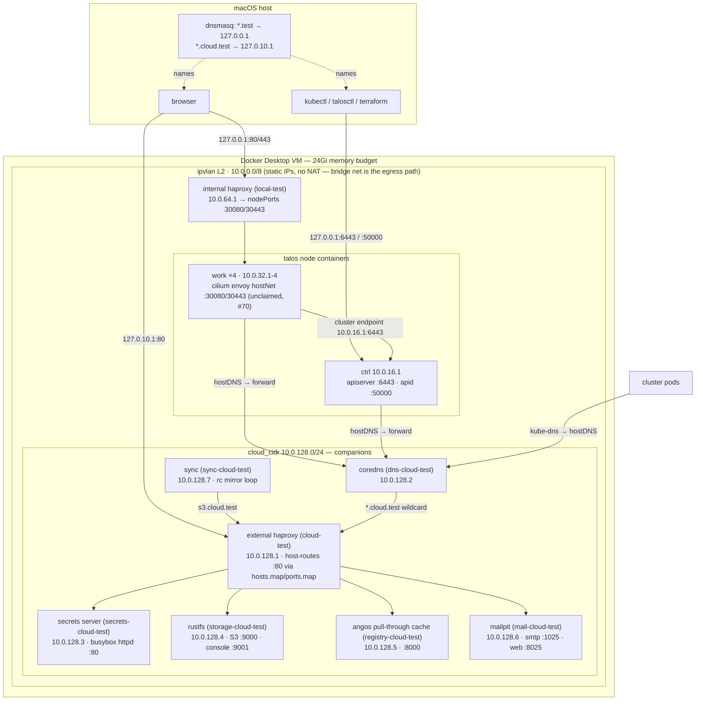

# Local cluster architecture

Topology of the Talos-in-Docker test cluster that terraform in this directory builds (`just cluster apply` → `just bootstrap apply`; rebuild procedure and data implications: [runbooks/local/cluster-rebuild.md](../../runbooks/local/cluster-rebuild.md)). Everything below the macOS host runs inside the Docker Desktop VM (24Gi memory budget).

## Topology

## Address allocation (`conf/`)

| CIDR | Used for |
|---|---|
| `10.0.0.0/8` | ipvlan "internal" network subnet (gateway `.1` is the VM) |
| `10.0.16.0/24` | ctrl nodes — `.1` is the single fixed control plane node |
| `10.0.32.0/24` | workers (`.1`-`.4`, count = `work_nodes`, default 4) |
| `10.0.64.0/24` | internal haproxy (ingress LB) — `.1` |
| `10.0.128.0/24` | companions — external proxy `.1`, coredns `.2`, secrets `.3`, rustfs `.4`, angos `.5`, mailpit `.6`, sync `.7` |

The bridge network carries no static IPs — every container attaches to it solely for NAT'd outbound internet (ipvlan L2 has none).

## API endpoint (no LB, cmdshift/platform#54)

The control plane is a **single fixed node** — there is no API LB and no ctrl-count knob (the old `cmd` haproxy and `ctrl_nodes` variable are gone; 3-node etcd saturated the Docker VM during the install burst — see the runbook's multi-ctrl ceiling note).

- Cluster endpoint (baked into certs/machine configs): `https://10.0.16.1:6443` — nodes reach it L2-direct
- Host access: the ctrl container publishes `6443`/`50000` on **`127.0.0.1` only** (not LAN-reachable)
- **The talos provider embeds the cluster endpoint as the kubeconfig/talosconfig host** — `talos_cluster_kubeconfig.endpoint` is only the fetch path. `nodes/outputs.tf` rewrites `kubeconfig` and `k8s_client_config.host` to `https://127.0.0.1:6443`; kubectl and the bootstrap terraform providers depend on that rewrite. In-cluster consumers must NOT use `127.0.0.1` (pod loopback) — `tools/bin/bench` rewrites the mounted kubeconfig's server to `kubernetes.default.svc:443` (a standard apiserver cert SAN; egress via the house `kube-apiserver` CNP entity)
- talosctl reaches **worker** apids through the ctrl node's apid proxying, same as it did through the LB

## DNS

| Zone / name | Resolves to | Served by |
|---|---|---|
| `*.cloud.test` | `10.0.128.1` (external proxy) | coredns `cloud.zone` (cluster side); host dnsmasq → `127.0.10.1` (browser side) |
| `*.local.test` | `10.0.64.1` (internal haproxy) | coredns `local.zone` |
| `*.test` (host) | `127.0.0.1` | host dnsmasq (setup: root README) |
| everything else | upstream resolvers | coredns `.:53` forward |

Pod DNS: kube-dns → talos hostDNS (`forwardKubeDNSToHost`) → coredns. Companion containers resolve the service names via **docker's embedded DNS** — the external proxy carries every service hostname as a network alias.

## Published host ports

| Host binding | Container | Purpose |
|---|---|---|
| `127.0.10.1:80` | cloud-test | `*.cloud.test` host-routing proxy (the **only** host route into the ipvlan network) |
| `127.0.0.1:80` / `127.0.0.1:443` | local-test | ingress LB → nodePorts 30080/30443 |
| `127.0.0.1:6443` / `127.0.0.1:50000` | ctrl container | kube-apiserver / talos apid |
| `:25` (cloud-test, private net) | — | SMTP passthrough → mailpit :1025 (alertmanager) |

## Request paths

- **Browser → companion**: dnsmasq `*.cloud.test` → `127.0.10.1:80` → Docker publisher → external haproxy → Host-header maps → backend container `ip:port`
- **Pod → S3/secrets/registry** (flux, external-secrets, velero, trivy): name → kube-dns → coredns wildcard → proxy → backend. All endpoints are normalized to `:80` — the `hosts.map`/`ports.map` own the real ports
- **Image pull**: containerd wildcard mirror (`RegistryMirrorConfig name: "*"` in the node machine config) → angos `?ns=` upstream resolution → cached in the `platform-registry-data` volume; strict (`skipFallback: true`) — unmapped registries hard-fail
- **Manifests → cluster**: repo bind-mount → sync container `rc mirror` (5s full re-mirror, `--remove`) → rustfs `flux` bucket → flux Bucket source → root Kustomization → dependency-ordered tree
- **Alerts**: ruler → alertmanager (CR) → `smtp.cloud.test:25` (TCP passthrough) → mailpit — read at http://mail.cloud.test

## Terraform roots

1. `cluster/local` — network, companions, talos nodes, secrets, kubeconfig/talosconfig (`.tmp/`). Outputs `bootstrap` (k8s client config + flux bucket credentials)
2. `cluster/local/bootstrap` — reads that output via local remote state; installs cilium + flux and the helm-hook Bucket/root Kustomization (flux-config force-adopts them on first reconcile). Carries `lifecycle.prevent_destroy` — `just bootstrap destroy` always fails by design

Companion state is disposable except the angos cache volume (see the registry landmine in the runbook). Node machine configs are baked into the container env with `ignore_changes` — template edits need a full rebuild, never just `apply`.

## Memory budget (docker-level limits)

Every container carries a `memory` limit with swap disabled (`memory_swap = memory`): ctrl 6Gi, work 4Gi each, rustfs 1Gi, haproxies/coredns/mailpit/angos 256Mi, secrets/sync 64Mi — Σ ≈ 23Gi against the 24Gi VM budget. Sizing is evidence-based (observed peaks: ctrl ≤4.1Gi, work ≤3.0Gi, rustfs ≤287Mi; companion peaks ≤91Mi).

**Limits do not influence the scheduler** (cmdshift/platform#54): each kubelet advertises the VM's full `/proc/meminfo` (~23.4Gi) as node capacity — ~117Gi of phantom capacity across 5 nodes is inherent to Talos-in-Docker. The limits only bound real consumption: breaching one OOM-kills that node container (node reboot, flux re-converges) instead of thrashing the whole VM. The monitoring stack's node-memory alerts fire on kubelet accounting, so they lag real pressure — the docker layer is the actual backstop.

## Decision records

- **Cluster→companion traffic keeps the haproxy hop** (cmdshift/platform#54): pointing coredns at direct service IPs would touch ~8 manifest files plus the node mirror config, lose the `:80` normalization, and save one sub-millisecond L2 hop. The proxy is also the only host-browser route (single published port + wildcard DNS).
- **In-cluster kubeconfig consumers use `kubernetes.default.svc:443`**, not node IPs — no hard-coded addresses, standard cert SANs, house CNP entity.
- **Gateway-API ingress is currently dead locally** (cmdshift/platform#70): cilium never claims the GatewayClass while the bootstrap pins `kubeProxyReplacement=false` — a documented prerequisite. The internal LB answers 503 until that lands.
