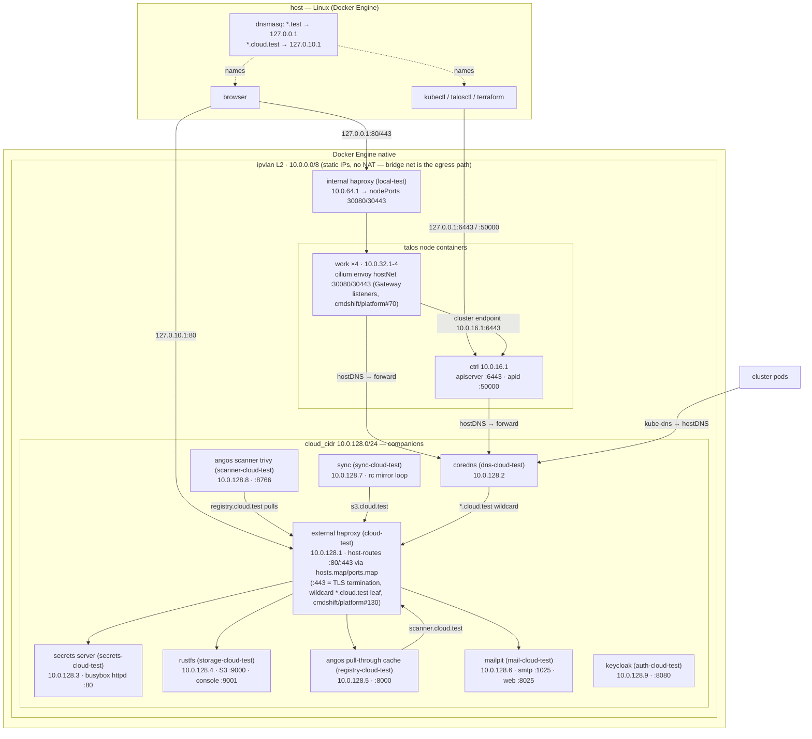

# Local cluster architecture

Topology of the Talos-in-Docker test cluster that terraform in this directory builds (`just cluster apply` → `just bootstrap apply`; rebuild procedure and data implications: [runbooks/local/cluster-rebuild.md](../../runbooks/local/cluster-rebuild.md)). The supported host is **Linux with Docker Engine** (tested on Arch, Docker Engine 29.7.2, 60Gi host RAM, 41Gi free at setup): containers run natively against host RAM, no VM, no publisher indirection, docker bridges host-routable. macOS/Docker Desktop was the original development host and the project outgrew it (VM memory budget, stale VM port-publisher bindings, bind mounts dropping inotify events); historical notes that reference the macOS/VM shape are kept in the runbooks where the failure shapes remain the best reference.

## Topology

## Address allocation (`conf/`)

| CIDR | Used for |
|---|---|
| `10.0.0.0/8` | ipvlan "internal" network subnet (gateway `.1` is the host) |
| `10.0.16.0/24` | ctrl nodes — `.1` is the single fixed control plane node |
| `10.0.32.0/24` | workers (`.1`-`.4`, count = `work_nodes`, default 4) |
| `10.0.64.0/24` | internal haproxy (ingress LB) — `.1` |
| `10.0.128.0/24` | companions — external proxy `.1`, coredns `.2`, secrets `.3`, rustfs `.4`, angos `.5`, mailpit `.6`, sync `.7`, scanner `.8`, keycloak `.9` |

The bridge network carries no static IPs — every container attaches to it solely for NAT'd outbound internet (ipvlan L2 has none).

## API endpoint (no LB, cmdshift/platform#54)

The control plane is a **single fixed node** — there is no API LB and no ctrl-count knob (the old `cmd` haproxy and `ctrl_nodes` variable are gone; 3-node etcd saturated the Docker VM during the install burst — see the runbook's multi-ctrl ceiling note).

- Cluster endpoint (baked into certs/machine configs): `https://10.0.16.1:6443` — nodes reach it L2-direct
- Host access: the ctrl container publishes `6443`/`50000` on **`127.0.0.1` only** (not LAN-reachable)
- **The talos provider embeds the cluster endpoint as the kubeconfig/talosconfig host** — `talos_cluster_kubeconfig.endpoint` is only the fetch path. `nodes/outputs.tf` rewrites `kubeconfig` and `k8s_client_config.host` to `https://127.0.0.1:6443`; kubectl and the bootstrap terraform providers depend on that rewrite. In-cluster consumers must NOT use `127.0.0.1` (pod loopback) — `tools/bin/bench` rewrites the mounted kubeconfig's server to `kubernetes.default.svc:443` (a standard apiserver cert SAN; egress via the house `kube-apiserver` CNP entity)
- talosctl reaches **worker** apids through the ctrl node's apid proxying, same as it did through the LB. The nodes module's `talos_machine_configuration_apply` resources follow the same loopback pattern (`endpoint` = 127.0.0.1, `node` = the target's private IP, worker applies routed through the ctrl apid) — the provider's private-IP default hangs in silent transport-retry, and the loopback pattern keeps the outputs rewrite uniform.

## DNS

| Zone / name | Resolves to | Served by |
|---|---|---|
| `*.cloud.test` | `10.0.128.1` (external proxy) | coredns `cloud.zone` (cluster side); host dnsmasq → `127.0.10.1` (browser side) |
| `*.local.test` | `10.0.64.1` (internal haproxy) | coredns `local.zone` |
| `*.test` (host) | `127.0.0.1` | host dnsmasq (setup: root README) |
| everything else | upstream resolvers | coredns `.:53` forward |

Pod DNS: kube-dns → talos hostDNS (`forwardKubeDNSToHost`) → coredns. Companion containers resolve the service names via **docker's embedded DNS** — the external proxy carries every service hostname as a network alias.

## Published host ports

| Host binding | Container | Purpose |
|---|---|---|
| `127.0.10.1:80` / `127.0.10.1:443` | cloud-test | `*.cloud.test` host-routing proxy (:443 TLS-terminates with the wildcard leaf, cmdshift/platform#130) — the **only** host route into the ipvlan network |
| `127.0.0.1:80` / `127.0.0.1:443` | local-test | ingress LB → nodePorts 30080/30443 |
| `127.0.0.1:6443` / `127.0.0.1:50000` | ctrl container | kube-apiserver / talos apid |
| `:25` (cloud-test, private net) | — | SMTP passthrough → mailpit :1025 (alertmanager) |

## Request paths

- **Browser → companion**: dnsmasq `*.cloud.test` → `127.0.10.1:80` or `:443` → Docker publisher → external haproxy (:443 terminates TLS with the `*.cloud.test` wildcard leaf from `just certs`, cmdshift/platform#130) → Host-header maps → backend container `ip:port` (backends stay plain HTTP — termination is the only scheme boundary)
- **Pod → S3/secrets/registry** (flux, external-secrets, velero, trivy): name → kube-dns → coredns wildcard → proxy → backend. All endpoints are normalized to `:80` — the `hosts.map`/`ports.map` own the real ports
- **Image pull**: containerd wildcard mirror (`RegistryMirrorConfig name: "*"` in the node machine config) → angos `?ns=` upstream resolution → cached in the `platform-registry-data` volume; strict (`skipFallback: true`) — unmapped registries hard-fail
- **Manifests → cluster**: repo bind-mount → sync container `rc mirror` (5s full re-mirror, `--remove`) → rustfs `flux` bucket → flux Bucket source → root Kustomization (path `./manifests/clusters/local` — the `manifests/bases/` + `manifests/clusters/local/` tree, layout in [manifests/README.md](../../manifests/README.md)) → dependency-ordered tree
- **Image scan** (cmdshift/platform#102): a cache-miss manifest store in a `scan = true` repo enqueues a job → the registry POSTs to `scanner.cloud.test` (generic `cloud` frontend + maps, `defaults` timeouts raised to 630s — see the decision record below) → trivy pulls the image via `registry.cloud.test` and answers SARIF → the registry pushes the report as an OCI referrer (`application/sarif+json`, visible via the referrers API and the angos UI Vulnerabilities tab). One job per client-resolved image manifest; already-cached images are never re-scanned (no backfill). Trivy downloads its own DB from upstream — the scanner dual-attaches the bridge like the registry (ipvlan has no egress). Referrers attach to the **platform child manifest digest** (the index entry the pulling client resolved), not the tag's index digest — query the referrers API against the child manifest; details in [runbooks/local/cluster-rebuild.md](../../runbooks/local/cluster-rebuild.md)
- **Alerts**: ruler → alertmanager (CR) → `smtp.cloud.test:25` (TCP passthrough) → mailpit — read at http://mail.cloud.test
- **OIDC auth** (cmdshift/platform#131): browser/kubelogin → `auth.cloud.test` (Keycloak, external haproxy) — realm `platform`, public client `kubernetes`; the kube-apiserver validates issued tokens against the same issuer (`--oidc-issuer-url=https://auth.cloud.test/realms/platform`, CA via a planted machine.files cert). RBAC mapping of the `groups` claim: cmdshift/platform#91

## Terraform roots

1. `cluster/local` — network, companions, talos nodes, secrets, kubeconfig/talosconfig (`.tmp/`); apply is not health-gated (the former `talos_cluster_health` gate was removed as redundant — the bootstrap root's apiserver readiness poll is the apply gate, cmdshift/platform#73 and cmdshift/platform#72). Outputs `bootstrap` (k8s client config + flux bucket credentials)
2. `cluster/local/bootstrap` — reads that output via local remote state; gates on an apiserver readiness poll before applying resources (cmdshift/platform#72); installs cilium + flux and the helm-hook Bucket/root Kustomization (flux-config force-adopts them on first reconcile; the bootstrap twin's `path` — `./manifests/clusters/local` — must match the root Kustomization CR's path in `manifests/clusters/local/flux-config/local.kustomization.yaml`). Carries `lifecycle.prevent_destroy` — `just bootstrap destroy` always fails by design

Companion state is disposable except the angos cache volume (see the registry landmine in the runbook). Node containers bake the machine config into the container env first-boot-only (`ignore_changes = [env]`), but template edits now converge via the nodes module's `talos_machine_configuration_apply` resources — `terraform apply` applies config to the running nodes without recreating them (cmdshift/platform#73); the applied config persists in the `/system/state` docker volume.

## Memory budget (docker-level limits)

Every container carries a `memory` limit with swap disabled (`memory_swap = memory`): ctrl 6Gi, work 4Gi each, rustfs 1Gi, haproxies/coredns/mailpit/angos 256Mi, secrets/sync 64Mi, scanner 768Mi (start-then-audit — trivy DB + scan working set; no OOM on the first real scan, cmdshift/platform#102), keycloak 3Gi (cmdshift/platform#131 — see below) — **Σ ≈ 28Gi**. Sizing is evidence-based (observed peaks: ctrl ≤4.1Gi, work ≤3.0Gi, rustfs ≤287Mi; keycloak settled 1.05GiB after import / ~730MiB post-restart idle; other companion peaks ≤91Mi). The limits run against host RAM (60Gi, 41Gi free at setup) — they bound real consumption, not scheduler capacity.

Keycloak is the heaviest companion by far (cmdshift/platform#131): docker-level limits of 1280Mi then 2Gi were OOM-killed (exit 137) mid-realm-import — JVM `MaxRAMPercentage=70` + 256Mi MaxMetaspace + H2 import churn — and 3Gi held. If it's ever slimmed, the import burst is the sizing event to re-test, not idle.

**Limits do not influence the scheduler** (cmdshift/platform#54): each kubelet advertises the container's full `/proc/meminfo` as node capacity (~117Gi of phantom capacity across 5 nodes is inherent to Talos-in-Docker — verified on the historical macOS VM where it was ~23.4Gi apiece; same mechanism on Linux, the kubelets advertise the host's meminfo). The limits only bound real consumption: breaching one OOM-kills that node container (node reboot, flux re-converges) instead of thrashing the host. The monitoring stack's node-memory alerts fire on kubelet accounting, so they lag real pressure — the docker layer is the actual backstop.

## Decision records

- **Auth: Keycloak as the single OIDC issuer; Dex rejected; dev-mode H2, not in-cluster postgres** (cmdshift/platform#131). Keycloak (companion module `cluster/local/auth/`, `auth.cloud.test`) is the cluster's only IdP — Dex was considered and rejected because there is no second OIDC upstream to federate; a second broker in the path was pure moving parts. Keycloak runs its dev-mode H2 storage instead of the in-cluster cnpg postgres: a companion depending on the in-cluster DB inverts the bootstrap order (cluster must be up before its auth companion). `KC_HOSTNAME=https://auth.cloud.test` + `KC_PROXY_HEADERS=xforwarded` are load-bearing (TLS terminates at the external haproxy, cmdshift/platform#130) — without the hostname env the discovery/issuer URLs render http and OIDC clients reject the metadata. Realm re-import only happens on container recreate (`--import-realm` IGNORE_EXISTING skips existing realms). RBAC/access mapping of the `groups` claim: cmdshift/platform#91.
- **OIDC CA reaches the kube-apiserver through `cluster.apiServer.extraVolumes`, not the CA patch alone** (cmdshift/platform#131). The planted machine.files cert (ctrl-only patch, `/var/etc/oidc/ca.crt`) is only half the wiring: the apiserver static pod renders a fixed hostPath set, so without `cluster.apiServer.extraVolumes` (Talos field names: hostPath/mountPath/`readonly`) the container cannot see the CA file and exits at OIDC init within seconds — etcd healthy, apiserver static pod "rendered", every StartContainer fails, **no container logs** (`talosctl logs -k` never catches it alive; cost 2 debug rounds + a cluster rebuild). The ctrl-only patch lives in `nodes/templates/ctrl.tftpl.yaml`; `base.tftpl.yaml` is deliberately NOT extended — workers never validate `auth.cloud.test`. Preview the RENDERED config when diagnosing machine-config surprises: `terraform state pull` → extract `data.talos_machine_configuration.ctrl.machine_configuration` → `yaml.safe_load_all` (multi-doc — config patches append separate docs).
- **Cluster→companion traffic keeps the haproxy hop** (cmdshift/platform#54): pointing coredns at direct service IPs would touch ~8 manifest files plus the node mirror config, lose the `:80` normalization, and save one sub-millisecond L2 hop. The proxy is also the only host-browser route (single published port + wildcard DNS).
- **Scan traffic rides the generic `cloud` frontend; `defaults` timeouts raised cluster-wide to 630s** (cmdshift/platform#102): the scanner is wired like every other host-mapped companion (hosts.map/ports.map entry) rather than a dedicated `cloud-scan` frontend — no special-case flatten loop or regex-prefixed service in the external module. The tradeoff, accepted deliberately: the 630s client/server timeouts (a scan POST waits silently for minutes, above the registry's 600s `timeout_secs`) apply to **all** map-routed traffic (secrets, s3, registry, mail web), so idle connections linger up to ~10m instead of 10s. For a single-tenant local cluster that costs nothing — no connection-exhaustion surface — and a per-backend timeout would have reintroduced the per-service special-casing the maps exist to avoid. The scanner and registry angos pins bump **in lockstep** (same release line: `registry/data.tf` ↔ `scanner/data.tf`).
- **In-cluster kubeconfig consumers use `kubernetes.default.svc:443`**, not node IPs — no hard-coded addresses, standard cert SANs, house CNP entity.
- **Kubernetes API audit policy is ctrl-node machine config** (cmdshift/platform#90): the reviewed policy body lives in `nodes/files/audit-policy.yaml` (literal Kubernetes Policy — authored so the Talos 1.14 migration can move it verbatim into `KubeAuditPolicyConfig.configuration`; on 1.13 it's templated inline into `cluster.apiServer.auditPolicy` via `templatefile` + `indent(6, ...)`). Ctrl-patch-list only — the worker config patch list is deliberately not extended (apiserver-only). `cluster.apiServer.auditLog` rotation knobs don't exist in 1.13; the apiserver defaults (maxAge 30 / maxBackup 10 / maxSize 100) already hold. **The static-pod render path is a strict decoder**: one unknown policy field takes down the kube-apiserver static pod and drops the node (post-mortem in [runbooks/local/incidents.md](../../runbooks/local/incidents.md)) — validate the policy schema before it lands in a template.
- **Gateway-API ingress lives locally** (cmdshift/platform#70): cilium runs `kubeProxyReplacement: true` and kube-proxy is gone (Talos `proxy.disabled: true` + a one-time DaemonSet delete — rendered-manifest apply never prunes). The internal haproxy fronts the Gateway's hostNetwork listeners, which bind on the k8s-role/work nodes only — the `servers` output feeding it is workers-only (the ctrl sat permanently check-down). Its `web_tls` frontend/backend is `mode tcp` passthrough — the Gateway terminates TLS; inherited `mode http` mangled the ClientHello (`tlsv1 alert protocol version` from curl), and the defaults' 10s timeout would cut idle TLS connections (`timeout server 10m`). Zero HTTPRoutes renders as a 404 from envoy on the HTTPS listeners; the one route that exists is the HTTP→HTTPS redirect (filter-only plumbing on the two HTTP listeners — `local-test-redirect.httproute.yaml`, the spec has no Gateway-level redirect knob) — 301 with a scheme-implied `:443` Location; 503 means the haproxy backends are down.
